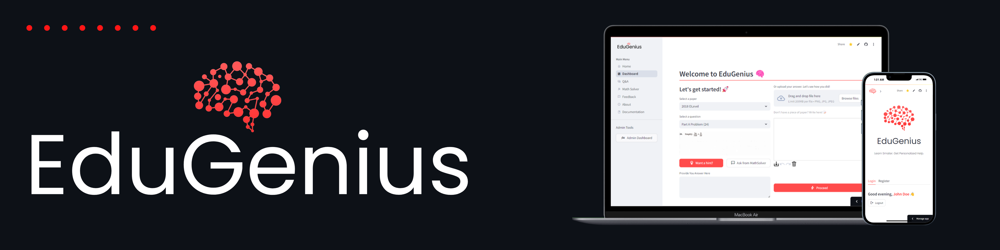
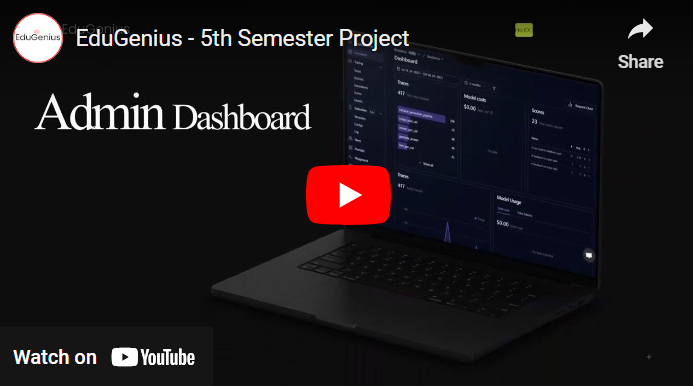

EduGenius is an innovative AI-powered tutoring platform developed by us who are three undergraduates at the Department of Computer Science and Engineering, University of Moratuwa, as our Semester 5 project.

The platform addresses challenges in modern education by offering personalized and efficient tutoring for O/Level students in mathematics. Leveraging advanced technologies such as LangChain and pre-processed mathematics marking schemes stored in a vector database, EduGenius generates tailored tutoring materials and provides instant, real-time feedback and grading. This approach enhances the learning experience, empowering students with a more interactive and supportive learning environment.

## Let's dive into a quick tour of the EduGenius platform.
[](https://www.youtube.com/watch?v=4JYE4jFudoI)

[Try EduGenius Now!](https://edugenius.streamlit.app/)

### Features
- **User Registration & Login**: Users can register and log in using their email addresses. Password recovery is also supported.
- **Math Problem Solving**: Students can select math problems, submit their answers via images or canvas input, and receive immediate feedback.
- **Hints & Tips**: If students get stuck, they can request hints from the system.
- **Feedback & Scoring**: EduGenius provides feedback on students' answers and scores them based on correctness.
- **Question Clarification**: Students can ask questions related to the problems and get clarifications from the system.
- **User Feedback**: Users can provide feedback on their tutoring experience.
- **Past Session Review**: Users can review their past tutoring sessions and check the marks obtained.
- **Math Solving Tool**: Integrated with Wolfram Alpha's API for step-by-step math problem solutions.
- **Admin Features**: Admins can manage content, user accounts, and generate reports.


###### Refer the [documentation](https://github.com/Irash-Perera/EduGenius/blob/e58c6a3b06366b594282ac6a3e33afa3198c562c/docs) for the technical details of the project.

#### Installation
1. **Clone the repository**:
Clone the repository to your local machine using the following command:
```
git clone https://github.com/Irash-Perera/EduGenius.git
```
2. **Install the dependencies**:
Navigate to the project directory and install the required dependencies using the following command:
```
pip install -r requirements.txt
```
3. **Run the application**:
Run the application using the following command:
```streamlit run app.py```


#### Contributors
- [Irash Perera](https://irash.me/)
- [Hansana Prabashwara](https://github.com/HansanaPrabashwara-210483T)
- [Pranavan Subendiran](https://github.com/Pranavan-S)

[](https://www.youtube.com/watch?v=RNSwMGIv4Kw)
