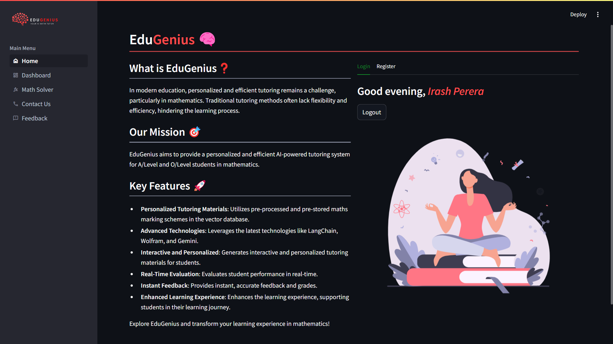

# EduGenius

>  Note: This project is under development. The file structure and the content of the project may change in the future. There are some features that are not implemented yet. See [Documentation](https://github.com/Irash-Perera/EduGenius/blob/e58c6a3b06366b594282ac6a3e33afa3198c562c/docs) for more details.

EduGenius is an interactive mathematics tutoring platform designed to help O/L students solve math problems. It leverages data science technologies such as Retrieval-Augmented Generation (RAG), Large Language Models (LLMs), and Object Character Recognition (OCR) to offer a personalized learning experience. Students can submit answers either by uploading images or using an interactive canvas, and they receive instant feedback and explanations.

### Features
- **User Registration & Login**: Users can register and log in using their email addresses. Password recovery is also supported.
- **Math Problem Solving**: Students can select math problems, submit their answers via images or canvas input, and receive immediate feedback.
- **Hints & Tips**: If students get stuck, they can request hints from the system.
- **Feedback & Scoring**: EduGenius provides feedback on students' answers and scores them based on correctness.
- **Question Clarification**: Students can ask questions related to the problems and get clarifications from the system.
- **User Feedback**: Users can provide feedback on their tutoring experience.
- **Past Session Review**: Users can review their past tutoring sessions and check the marks obtained.
- **Math Solving Tool**: Integrated with Wolfram Alpha's API for step-by-step math problem solutions.
- **Admin Features**: Admins can manage content, user accounts, and generate reports.

Screenshot from the dashboard:

Screenshot from the math problem solving page:
